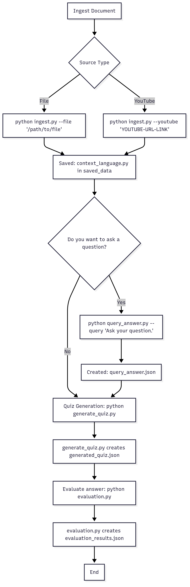

# EKET 

EKET is a package for loading the documents(`.xls, .xlsx, .pdf, .csv, .md, youtube-links, .pptx, .txt, .json`) and converting them into the chunks which has meaning for the further instructions from the user.

We can generate quiz, answers & explanations and answers for topic-based questions.

### The Folder Structure

```bash
EKET/                         # Root directory of the project
├── EKET/                     # Main Python package (importable as EKET)
│   ├── __init__.py           # Initializes EKET as a package
│   ├── answer.py             # Answering the created quiz questions
│   ├── clean.py              # Functions for cleaning input/output data
│   ├── create.py             # Utilities for creating or generating quiz
│   ├── ingest.py             # Handles document ingestion (loading and chunking files)
│   ├── query.py              # Answering the specific question from the user
│   ├── utils.py              # Helper functions used across multiple modules
│   ├── data_ingest/          # Subpackage for modular ingestion logic
│   ├── evaluate_quiz/        # Subpackage to evaluate quiz answers, scoring, feedback
│   ├── generate_answer/      # Subpackage to generate answers
│   └── generate_quiz/        # Subpackage to create quiz questions from source material
├── example_usage/            # Example scripts or notebooks showing how to use the package
├── tests/                    # Unit and integration tests for all modules
├── README.md                 # Project description, usage instructions, and documentation
├── requirements.txt          # Requirements
└── setup.py                  # Setup script for packaging and installing the project
```


### Installation

1) Clone the GitHub repository.
2) Go to the folder and run the script below.
```bash
pip install -r requirements.txt
```

3) For additional (to make sure), install those packages for image processing
```bash
pip install pillow google-generativeai
```

4) For HTML rendering

```bash
pip install playwright
playwright install
```


```bash
pip install -e .
```

5) In the `example_usage` folder, it is demonstrated that how to use the package correctly. You can get inspired by it and anaylze the package better. You need to REMOVE it from EKET while installing.

**Note: Some requirements may be not in the list, please after the installation, check your packages.**

### How to Use

- For debugging and testing phase, in the current working place, you need to do files like below:
```bash
python example_usage/ingest.py --file "path/to/file.png" # supported files above.
```
- for YouTube:
```bash
python example_usage/ingest.py --youtube "Youtube-URL"   # YouTube URL  
```


- After starting `example_usage/ingest.py`, there will be folders that created in the current folder named `chroma` which is the vectorized database for chunks, `saved_data` which contains `context_language.json` formatted data in it.

- Then, if you want to generate quiz (multiple-choice and open-ended), you are going to initialize `example_usage/generate_quiz.py`. But it has some different kind of logic. Let me explain:
	-  If you directly initialize the `example_usage/generate_quiz.py`, it will create the questions from all the documents the user is provided.
	- If you initialize the `example_usage/generate_quiz.py` after initializing `example_usage/query_answer.py`, then the questions will be much more relevant to the asked question.

- To initialize the `example_usage/query_answer.py`, you should use it in the terminal that:

```bash
python example_usage/query_answer.py --query "Your question here..."
```

- Lastly, `example_usage/evaluation.py` which indicates the evaluation of the solved generated quiz by the user. It informs the user how good one did and explains the question to make a better understanding.


### Example Usage Scenario

Here is the simple designed FlowChart of the EKET-package:




1) Ingesting the documents that want to be studied on:
For Files:
```bash
python example_usage/ingest.py --file "/path/to/file"
```
For YouTube:
```bash
python example_usage/ingest.py --youtube YOUTUBE-URL-LINK
```

It will yield `context_language.json` file. Other operations will be depend on this file. (e.g. creating questions, generating quiz).

2) Do you want to ask a specific question? If yes:

```bash
python example_usage/query_answer.py --query "Your Question"
```

And it will yield `context_question_answer.json`. If it is created, the quiz generation(next step) will depend on this question. 

3) Creating the quiz:

```bash
python example_usage/generate_quiz.py
```

It will yield `generated_quiz.json`. 

4) Evaluating the solved quiz:

```bash
python example_usage/evaluation.py
```

It will yield `evaluation_results.json`. It will create this file from `generated_quiz.json` and answers of the user.


- Optional:

```bash
python example_usage/summarize.py 
```

It will yield `combined_summary.json`. It has a summarization of `context_language.json`. 


The `example_usage` folder contains the examples of the output files. While it all returns a `.json` file, you can also manipulate the files to the attributes we've assigned them to.


## License
This project is licensed under the GNU General Public License v3.0 or later (GPL-3.0-or-later).
See the LICENSE file for details.